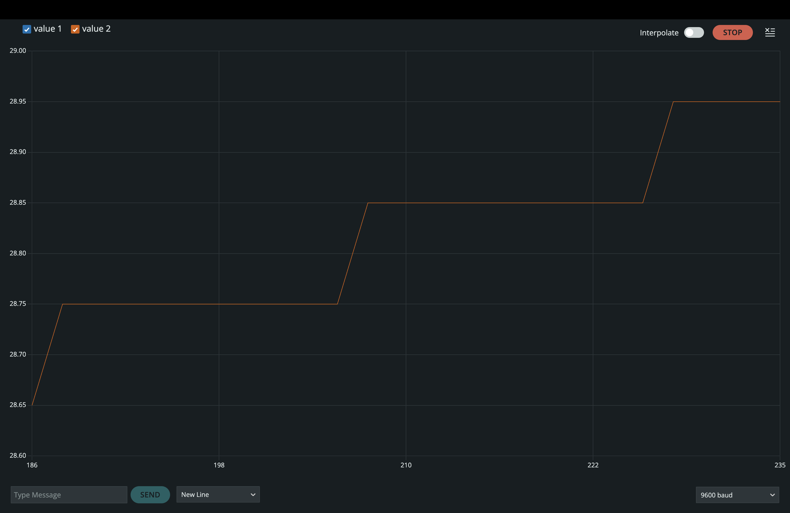
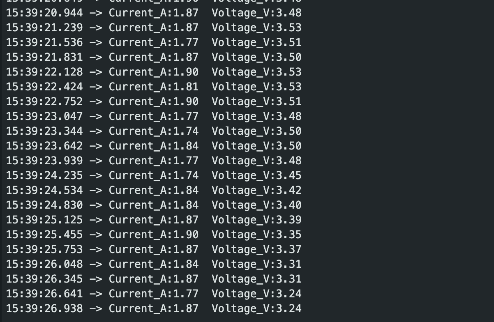
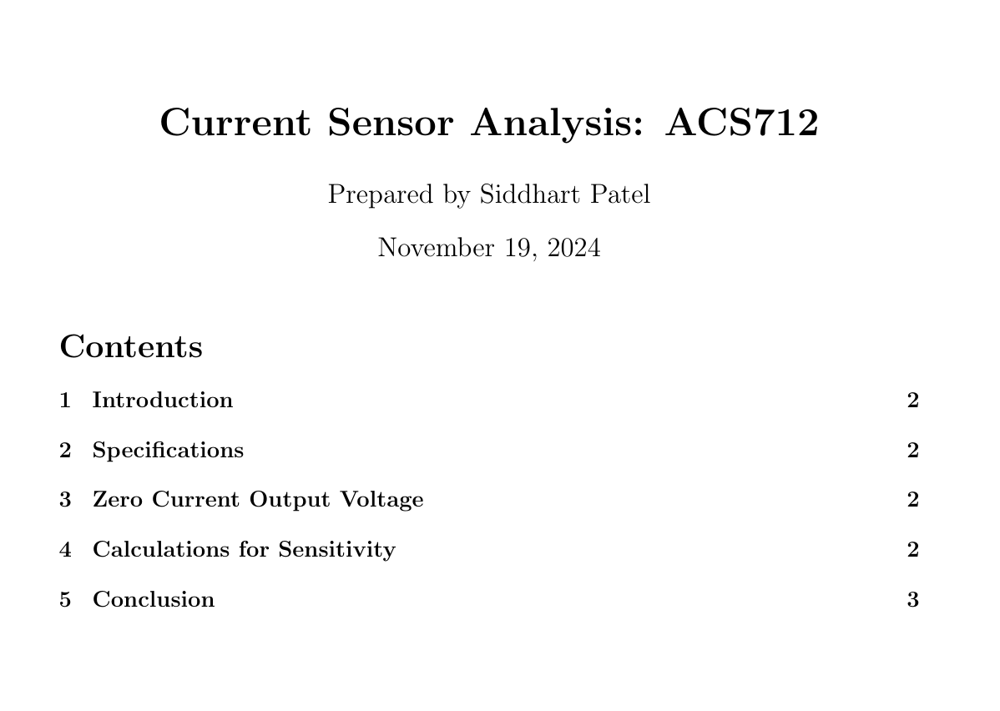
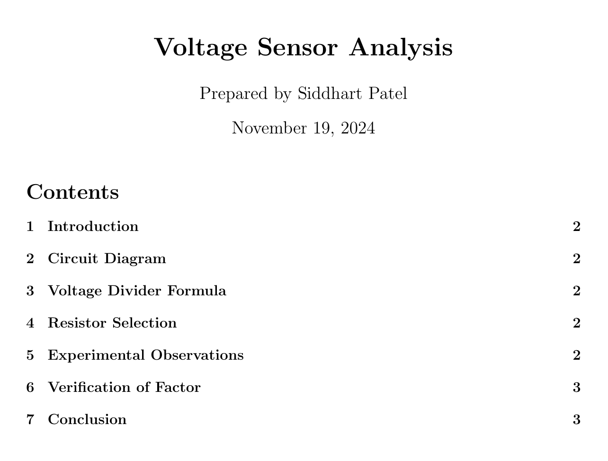

# Solar Cell Test Bench Project

## Overview
This project aims to develop a test bench for analyzing the voltage and current behavior of a solar cell under varying surrounding temperatures. The project is a collaborative effort between **Konstantin Sang** and **Siddhart Patel**. Konstantin is responsible for the mechanical design and literature, while Siddhart handles the electronics and programming aspects.

## Project Goal

1. **Monitoring surrounding temperature** with two DHT22 sensors.
2. **Controlling a heating element** through a relay setup.
3. **Implementing a P algorithm** for maintaining a desired temperature range, using real-time temperature feedback.

*More mini goals will be added in the future as the project progresses.*

## Current Work Steps

### Step 1: Temperature Monitoring
- Utilize two DHT22 temperature sensors to capture the ambient temperature.
- Calculate the **RMS** and **average** temperature values from both sensors to ensure a precise and stable reading.

**Status:** DONE

**Video Demonstration:**  
[](https://drive.google.com/file/d/1SOkulpQlxXZBvUerqa7_w0ityK85tI0_/view?usp=sharing)

**Library Used:**  
- [DHT Sensor Library by Adafruit](https://github.com/adafruit/DHT-sensor-library)

### Step 2: Temperature Control
- Integrate a heating element, controlled by a relay, to adjust the surrounding temperature.
- Program the microcontroller to turn the heating element on or off as needed to reach target temperatures.

**Status:** DONE

**Video Demonstration:**  
[](https://drive.google.com/file/d/1z0Fc_PCY5TwjSFO1WZ3Zr_VHilqgq-di/view?usp=sharing)


### Step 3: Implementing a Control Algorithm
- Continuously monitor the **RMS** temperature and adjust the heating element's operation to minimize deviations from the target value.
- Achieve a stable environment by dynamically controlling the heating element based on real-time feedback from the sensors.

**Status:** DONE

**Video Demonstration:**  
[](https://drive.google.com/file/d/1_RXI9lnvPoCz-GgphQD-YolMGGgfK2b0/view?usp=sharing)

### Step 4: Sensor Testing and Integration
- Test the **ACS712 Current Sensor** with both Arduino and Raspberry Pi Pico.
- Test the **Voltage Sensor** with both Arduino and Raspberry Pi Pico.
- Combine the individual codes to create a unified script for measuring both current and voltage simultaneously.

**Status:** DONE

**Video Demonstration:**  
[](https://drive.google.com/file/d/1DAmKEw3BYv09oknZa6eHkeQwC9B74rZi/view?usp=sharing)

**PDF Demonstration:**  

- **Current Sensor Analysis: ACS712**  
[](docs/Current_Sensor_Analysis_ACS712.pdf)

- **Voltage Sensor Analysis**  
[](docs/Voltage_Sensor_Analysis.pdf)


*More steps will be added in the future*

### Prerequisites
- Arduino or compatible microcontroller
- DHT22 temperature sensors (2x)
- Relay and MOSFET for heating element control
- Heating element

### Installation
1. Clone this repository to your local machine.
   ```bash
   git clone https://github.com/your-username/solar-cell-test-bench.git

## Author

**Siddharth A. Patel**  
GitHub: [siddharthpatelde](https://github.com/siddharthpatelde?tab=overview&from=2024-10-01&to=2024-10-17)

## Credits
- **Circuit Design and Electronics Programming**: All coding, electronics, and circuit design are done by Siddharth A. Patel.
- **Project Introduction and Mechanical/Literature Work**: Konstantin Sang introduced the project and is responsible for the mechanical design and literature.